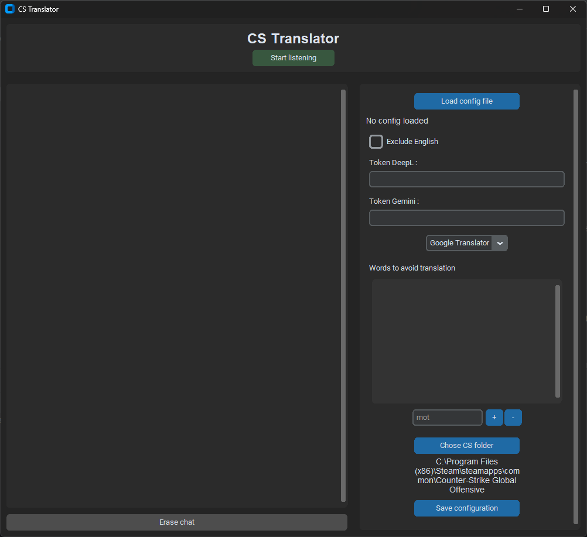
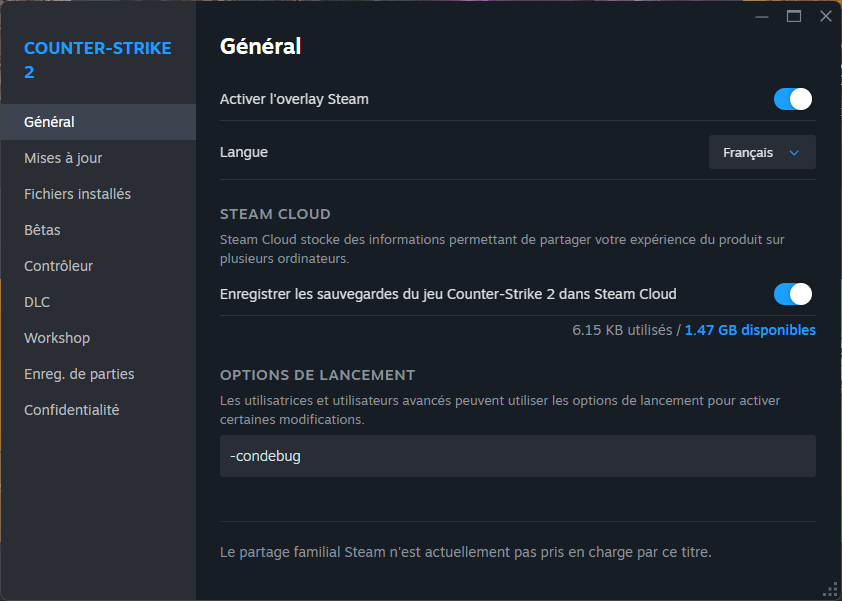

# CS Translator 🌐

CS Translator est une application de bureau conçue pour les joueurs de Counter-Strike, qui écoute en temps réel le chat du jeu et le traduit instantanément dans la langue de votre choix. Fini les barrières de la langue avec vos coéquipiers !



---

## ✨ Fonctionnalités

* **Traduction en Temps Réel :** Lit le fichier `console.log` de Counter-Strike et traduit les messages dès leur apparition.
* **Multi-Moteurs de Traduction :** Supporte plusieurs services pour une flexibilité maximale :
    * **Google Translate** (gratuit, sans clé API)
    * **DeepL** (nécessite une clé API, rapide à récupérer)
    * **Gemini** (nécessite une clé API Google AI Studio, rapide à récupérer)
* **Système de Cache :** Les messages déjà traduits sont stockés en mémoire pour économiser les appels aux API et fournir une réponse instantanée en cas de spam.
* **Interface de Configuration Complète :**
    * Chargez et sauvegardez vos configurations dans un fichier `.json`.
    * Gérez vos clés API.
    * Excluez certaines langues de la traduction (ex: ne pas traduire l'anglais).
    * Définissez une liste de mots à ignorer pour éviter de traduire des pseudos ou du jargon.
    * Spécifiez manuellement le chemin de votre dossier Counter-Strike.
* **Affichage Clair :** Indique clairement quel message a été traduit, par quel moteur, depuis quelle langue, et si la traduction provient du cache.

## ⚙️ Comment ça marche ?

L'application fonctionne grâce à un processus simple mais efficace :

1.  Un **thread d'arrière-plan** est lancé lorsque vous activez l'écoute (vous noterez la présence d'un While True dans le code, c'est pour le générateur, celui ne consomme pas de ressource inutilement).
2.  Ce thread surveille en permanence le fichier `.../csgo/console.log` pour toute nouvelle ligne ajoutée.
3.  Il filtre les lignes pour ne garder que les messages du chat des joueurs (grâce aux tags comme `[T]`, `[CT]`, `[AT]`, `[ALL]`, `[GÉNÉRAL]`).
4.  Le nom du joueur et le message sont extraits.
5.  Le message est envoyé à notre module `Translator` qui :
    * a.  Vérifie d'abord si une traduction pour ce message (avec le même moteur) existe dans le **cache**.
    * b. Vérifie si ce n'est pas un mot à ne pas traduire (gg, ggez, glhf, etc. Dans le but d'éviter des appels API)
    * c.  Si ce n'est pas le cas, il détecte la langue d'origine.
    * d.  Il appelle l'API du moteur de traduction que vous avez sélectionné.
    * e.  Il stocke le résultat de la traduction dans le cache pour les futurs messages identiques.
6.  Le résultat (traduction ou message original) est envoyé à l'interface principale via une **queue thread-safe**.
7.  L'interface affiche le message formaté dans la zone de chat.
8. **/!\ Ne pas oublier de spécifier l'option de lancement dans steam /!\**

## 🚀 Installation et Lancement

Pour utiliser l'application, suivez ces étapes :

1.  **Clonez le dépôt :**
    ```bash
    git clone https://github.com/JoseLeBoucher/cs-translator.git
    cd cs-translator
    ```

2.  **Installez les dépendances :**
    ```bash
    pip install -r requirements.txt
    ```

3. **Allez dans steam et mettez le paramètre suivant dans le lancement de CS**
    ```bash
    -condebug
    ```
    

4.  **Lancez l'application :**
    ```bash
    python main.py
    ```

## 🔧 Configuration

À la première ouverture, il est recommandé de :
1.  **Configurer le chemin du jeu :** Cliquez sur "Chose CS folder" et sélectionnez le dossier principal de votre installation de Counter-Strike (un chemin par défaut est déjà mis en place !).
2.  **Ajouter vos clés API :** Si vous souhaitez utiliser DeepL ou Gemini, collez votre clé API dans le champ correspondant.
3.  **Sauvegarder la configuration :** Cliquez sur "Save configuration" pour créer un fichier `.json`. À la prochaine ouverture, vous pourrez utiliser "Load config file" pour tout recharger en un clic.

## 📂 Structure du Projet

* `main.py` : Le cœur de l'application. Gère l'interface graphique (avec `CustomTkinter`), le threading, et l'orchestration générale.
* `extraction.py` : Contient la logique pour lire le fichier de log et extraire les informations pertinentes (nom du joueur, message).
* `translation.py` : Contient la classe `Translator` qui gère les appels aux API, le système de cache et la logique de traduction.
* `lang_data.py` : Fichier de données statiques contenant les dictionnaires de langues.
* `requirements.txt` : Liste des bibliothèques Python nécessaires.

## 💡 Améliorations ? Oui, si le temps me le permets

Ce projet peut encore être amélioré ! Voici quelques idées :
* **Persistance du cache :** Sauvegarder le cache dans un fichier pour qu'il ne soit pas perdu à chaque redémarrage de l'application.
* **Support d'autres jeux :** Rendre le système d'extraction de logs configurable pour s'adapter à d'autres jeux (Valorant, etc.).
* **Interface de gestion des langues :** Permettre à l'utilisateur de choisir la langue cible directement depuis l'interface (j'ai entendu parler de i18n).

---

Projet développé avec ❤️. N'hésitez pas à contribuer !